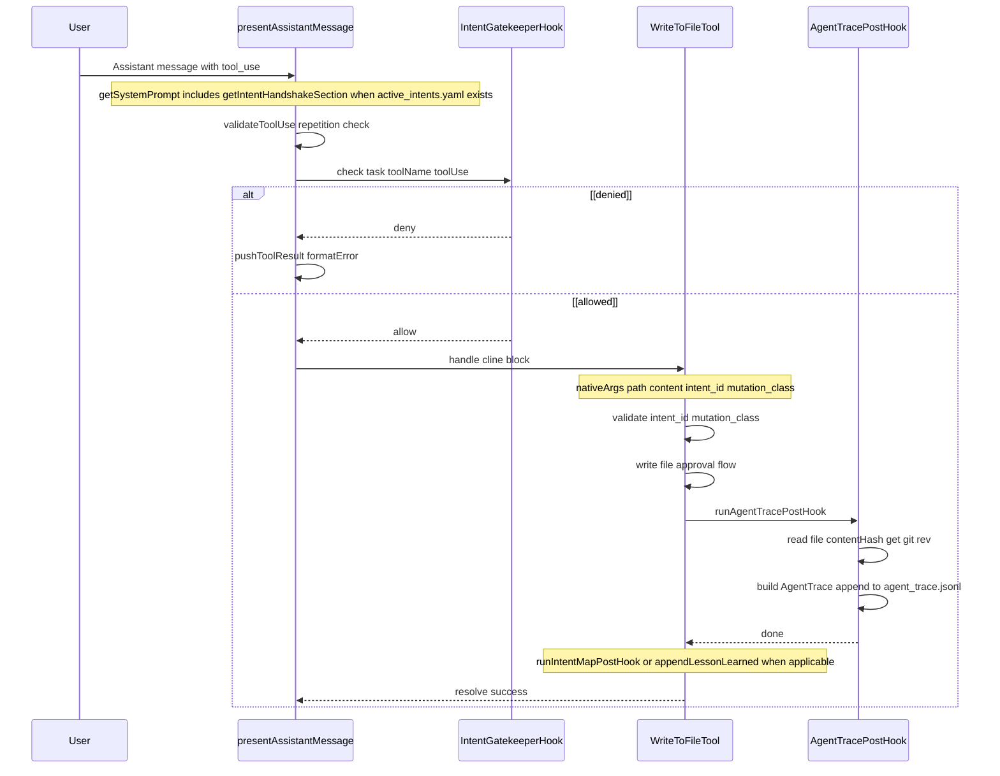
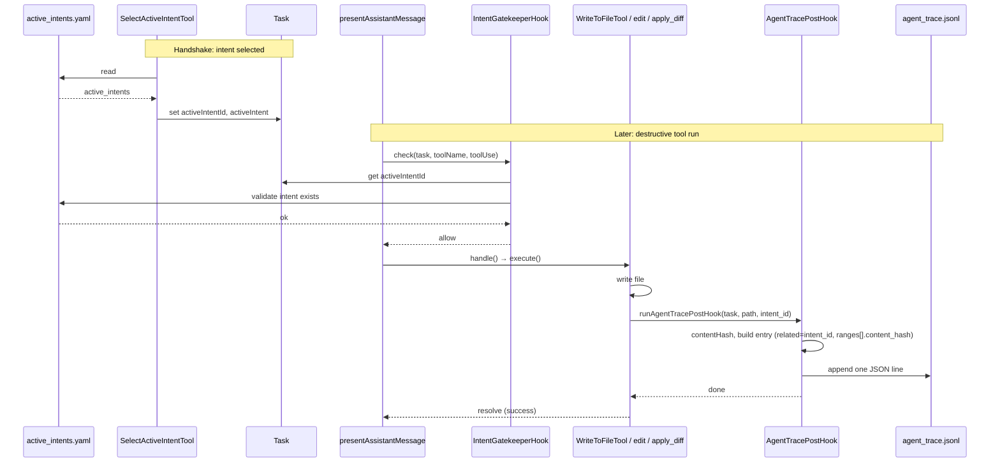
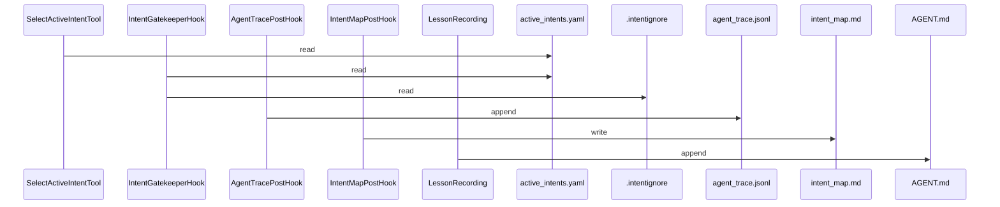

# TRP1 Challenge Week 1 — Final Submission Report

**Architecting the AI-Native IDE & Intent-Code Traceability**

This report is written for reviewers and readers of the project. It describes what was built, the data models and architecture, and the rationale behind key decisions so you can assess the implementation and, if needed, understand or reimplement it from this document alone. The content is derived from the codebase and aligned with the TRP1 Challenge specification.

---

## 1. Executive Summary

The Roo Code extension has been instrumented with a **Deterministic Hook System** that:

1. **Enforces context** via `.orchestration/active_intents.yaml` and a mandatory **Reasoning Loop** (handshake): the agent must call `select_active_intent(intent_id)` before any destructive action.
2. **Traces intent to code** through an append-only ledger (`.orchestration/agent_trace.jsonl`) linking Intent IDs to content hashes and VCS revision, with mutation classification (AST_REFACTOR vs INTENT_EVOLUTION) on `write_to_file`.
3. **Automates governance** by updating `intent_map.md` on INTENT_EVOLUTION and appending "Lessons Learned" to `.orchestration/AGENT.md` when verification (e.g. linter) fails.

The design addresses the challenge’s problem domain: the append-only trace and content hashing reduce **Trust Debt** by making every change verifiable; the intent-driven protocol and curated context (active intents, handshake) mitigate **Context Rot** and **Cognitive Debt** by keeping the agent aligned with declared intents and reducing blind acceptance of outputs. The hook engine acts as a **middleware boundary**: pre-hooks (Intent Gatekeeper) validate intent, scope, and optimistic locking; post-hooks (Agent Trace, Intent Map, Lesson Recording) update orchestration artifacts. Hooks are isolated in `src/hooks/`, composable, and fail-safe (errors block execution or are logged without breaking the tool loop).

---

## 2. How the VS Code Extension Works

### 2.1 Three-Layer Model

| Layer              | Responsibility                                                                                                                       |
| ------------------ | ------------------------------------------------------------------------------------------------------------------------------------ |
| **Webview**        | UI only; communicates with Extension Host via `postMessage` / `onDidReceiveMessage`. No file system, no API keys, no tool execution. |
| **Extension Host** | Task lifecycle, prompt building, tool routing, hook execution, API calls to LLM, secrets, file system.                               |
| **LLM Backend**    | Receives prompts and tool definitions; streams back text and tool calls.                                                             |

All tool execution and hook logic run in the **Extension Host**. The webview sends user messages (e.g. `sendMessage`, `newTask`); the extension builds the system prompt, calls the LLM, parses tool calls, runs the Intent Gatekeeper pre-hook, dispatches to tools, runs post-hooks where applicable, and pushes results back to the webview.

### 2.2 Tool Loop (High Level)

1. **LLM stream** → tool_call chunks parsed by `NativeToolCallParser` → `ToolUse` objects.
2. **presentAssistantMessage()** processes each tool block: validates tool, checks repetition, then runs **IntentGatekeeperHook.check()** (pre-hook).
3. If the hook allows, the switch routes to the tool handler (e.g. `WriteToFileTool.handle()` → `execute()`).
4. After a successful write, tools call **runAgentTracePostHook**, and optionally **runIntentMapPostHook** and **appendLessonLearned**.
5. Tool result is pushed to the conversation; the next API call may include updated state.

When `.orchestration/active_intents.yaml` exists, the **system prompt** includes the Intent-Driven Protocol (via `getIntentHandshakeSection`), requiring the model to call `select_active_intent` before destructive tools. The gatekeeper enforces that at runtime.

---

## 3. Detailed Schemas

### 3.1 active_intents.yaml

Tracks business intents and their scope. Stored in `.orchestration/active_intents.yaml`. A reviewer can reconstruct the data structure from the following.

**Field-level schema:**

| Field                        | Type            | Required | Description                                             |
| ---------------------------- | --------------- | -------- | ------------------------------------------------------- |
| `active_intents`             | array of Intent | yes      | Top-level key.                                          |
| Intent.`id`                  | string          | yes      | Unique identifier (e.g. `"INT-001"`).                   |
| Intent.`name`                | string          | no       | Human-readable name.                                    |
| Intent.`status`              | string          | no       | One of `IN_PROGRESS`, `COMPLETED`, `PENDING`.           |
| Intent.`owned_scope`         | string[]        | no       | Glob patterns; empty or omitted = no scope restriction. |
| Intent.`constraints`         | string[]        | no       | Rules the agent must follow.                            |
| Intent.`acceptance_criteria` | string[]        | no       | Definition of done.                                     |

**Example:**

```yaml
active_intents:
    - id: "INT-001"
      name: "Build Weather API"
      status: "IN_PROGRESS"
      owned_scope:
          - "src/**"
          - "src/api/**"
      constraints:
          - "Use TypeScript"
      acceptance_criteria:
          - "Unit tests in tests/ pass"
```

- **Who reads:** `SelectActiveIntentTool`, `IntentGatekeeperHook` (pre-hook). **Who writes:** no hook writes this file in the current implementation; it is maintained by humans or external tooling. **Trigger:** read on every `select_active_intent` call and on every destructive-tool pre-check.

### 3.2 agent_trace.jsonl (Agent Trace Schema)

Append-only, one JSON object per line. Each entry represents one mutating action and links it to an intent and content hash.

**TypeScript interfaces (from `src/hooks/types.ts`):**

```typescript
interface AgentTraceEntry {
	id: string // UUID v4
	timestamp: string // ISO 8601
	vcs: { revision_id: string | null }
	files: AgentTraceFile[]
}

interface AgentTraceFile {
	relative_path: string
	conversations: AgentTraceConversation[]
}

interface AgentTraceConversation {
	url: string // session/task identifier
	contributor: { entity_type: "AI"; model_identifier: string }
	ranges: AgentTraceRange[]
	related: AgentTraceRelated[]
}

interface AgentTraceRange {
	start_line: number
	end_line: number
	content_hash: string // "sha256:" + hex digest
}

interface AgentTraceRelated {
	type: "specification"
	value: string // Intent ID (e.g. "INT-001")
}
```

**Example line in agent_trace.jsonl:**

```json
{
	"id": "uuid",
	"timestamp": "2026-02-21T12:00:00.000Z",
	"vcs": { "revision_id": "abc123" },
	"files": [
		{
			"relative_path": "src/api/weather.ts",
			"conversations": [
				{
					"url": "task-id",
					"contributor": { "entity_type": "AI", "model_identifier": "claude-3-5-sonnet" },
					"ranges": [
						{
							"start_line": 1,
							"end_line": 50,
							"content_hash": "sha256:a8f5f167f44f4964e6c998dee827110c..."
						}
					],
					"related": [{ "type": "specification", "value": "INT-001" }]
				}
			]
		}
	]
}
```

- **Who writes:** `runAgentTracePostHook()` (called from `WriteToFileTool`, `EditFileTool`, `ApplyDiffTool`). **Who reads:** not read by hooks in the current implementation (available for audit or tooling). **Trigger:** immediately after a successful write; one JSON line appended per write. Content hash is computed via `contentHashSha256(content)` (SHA-256, format `sha256:<hex>`).

### 3.3 intent_map.md

Markdown file mapping intent titles to file paths. Structure:

```markdown
# Intent Map

Maps business intents to files. Updated when INTENT_EVOLUTION occurs.

## INT-001: Build Weather API

- `src/api/weather.ts`
- `src/api/routes.ts`

## INT-002: Auth Middleware

- `src/auth/middleware.ts`
```

- **Who writes:** `runIntentMapPostHook()` (called only from `WriteToFileTool`). **Who reads:** not read by hooks (for human or tool consumption). **Trigger:** when `mutation_class === "INTENT_EVOLUTION"` on a successful write. Section titles are resolved from `active_intents.yaml` (id + name).

### 3.4 write_to_file Tool Schema (Phase 3)

The native tool schema (`src/core/prompts/tools/native-tools/write_to_file.ts`) includes:

| Parameter             | Type   | Required | Description                                   |
| --------------------- | ------ | -------- | --------------------------------------------- |
| path                  | string | Yes      | File path relative to workspace               |
| content               | string | Yes      | Full file content                             |
| intent_id             | string | Yes      | Active intent ID from select_active_intent    |
| mutation_class        | string | Yes      | `AST_REFACTOR` or `INTENT_EVOLUTION`          |
| expected_content_hash | string | No       | For optimistic locking; from read_file result |

**Mutation classes:** AST_REFACTOR = refactor/rename/move without behavior change; INTENT_EVOLUTION = new feature or requirement change. This supports the rubric’s “Distinguishes Refactors from Features mathematically.”

### 3.5 .intentignore

Optional. Supports two locations: `.orchestration/.intentignore` and workspace root `.intentignore`. Merged by the gatekeeper.

- **intent:** lines — exclude specific intent IDs from being used for destructive actions.
- **Path lines** — glob patterns; files matching these are blocked for destructive tools.

- **Who reads:** `IntentGatekeeperHook` only. **Who writes:** no hook writes this file; human or tool maintained. **Trigger:** read at the start of each destructive-tool check.

### 3.6 AGENT.md (shared brain)

The shared brain file lives at `.orchestration/AGENT.md`. It is append-only in the current implementation: only **Lesson Learned** sections are written by the system. A reviewer can reconstruct the format as follows.

**Schema (machine-written sections only):**

Each appended block has this structure (no formal schema file; this is the contract from `LessonRecording.ts`):

| Element         | Format                                | Description                                                          |
| --------------- | ------------------------------------- | -------------------------------------------------------------------- |
| Section heading | `## Lesson Learned (YYYY-MM-DD)`      | Date is ISO date (first 10 chars of `new Date().toISOString()`).     |
| **File:**       | `**File:**` followed by relative path | The file that had problems.                                          |
| **Problems:**   | `**Problems:**` followed by text      | The linter/verification message (single block, no nested structure). |

**Example appended block:**

```markdown
## Lesson Learned (2026-02-21)

**File:** src/api/weather.ts
**Problems:**
Type 'string' is not assignable to type 'number'.
```

- **Who writes:** `appendLessonLearned(cwd, filePath, problemsMessage)` in `LessonRecording.ts`, invoked from write tools when `newProblemsMessage` is non-empty after save. **Who reads:** not read by hooks (for humans or future tooling). **Trigger:** after a write tool’s save when the post-save linter/diagnostics produce a non-empty `newProblemsMessage`. No other hooks or tools write to AGENT.md; other content (e.g. hand-written rules) may exist above the appended sections.

### 3.7 Data model ownership and triggers

The following table summarizes which component reads or writes each orchestration artifact and when. This gives a single reference for reconstructing update semantics.

| Artifact              | Reader(s)                                    | Writer(s)                           | Trigger for write                                                      |
| --------------------- | -------------------------------------------- | ----------------------------------- | ---------------------------------------------------------------------- |
| `active_intents.yaml` | SelectActiveIntentTool, IntentGatekeeperHook | None (human/tool)                   | —                                                                      |
| `agent_trace.jsonl`   | —                                            | AgentTracePostHook                  | After successful write (WriteToFileTool, EditFileTool, ApplyDiffTool). |
| `intent_map.md`       | —                                            | IntentMapPostHook                   | When mutation_class is INTENT_EVOLUTION (WriteToFileTool only).        |
| `AGENT.md`            | —                                            | LessonRecording.appendLessonLearned | When a write tool has newProblemsMessage after save.                   |
| `.intentignore`       | IntentGatekeeperHook                         | None (human/tool)                   | —                                                                      |

---

## 4. Architecture of the Agent and Hook System

### 4.1 Hook Engine Layout

```
src/hooks/
├── index.ts                    # Exports hooks and types
├── types.ts                    # HookResult, HookContext, AgentTrace* types
├── IntentGatekeeperHook.ts    # Pre-execution: intent, scope, stale-file
├── AgentTracePostHook.ts       # Post-write: append to agent_trace.jsonl
├── IntentMapPostHook.ts        # Post-write (INTENT_EVOLUTION): update intent_map.md
├── LessonRecording.ts          # appendLessonLearned → .orchestration/AGENT.md
└── __tests__/
    ├── IntentGatekeeperHook.spec.ts
    ├── AgentTracePostHook.spec.ts
    ├── IntentMapPostHook.spec.ts
    └── LessonRecording.spec.ts
```

### 4.2 Middleware / Interceptor Pattern

- **Pre-hook:** Single entry point — `IntentGatekeeperHook.check(context)`. Invoked from `presentAssistantMessage.ts` **before** the tool switch dispatches to any tool. Returns `HookResult { allow, error?, errorType?, actionHint?, recoverable? }`. On `allow: false`, the caller formats a JSON tool error (via `IntentGatekeeperHook.formatError`) and pushes it as tool result; the tool’s `handle()` is never called.
- **Post-hooks:** Called from inside tool implementations after a successful write (e.g. `WriteToFileTool`, `EditFileTool`, `ApplyDiffTool`). They do not block execution; they log on failure so trace/intent-map/lesson writes do not break the tool.

### 4.3 Integration Points

| Component                                          | Role                                                                                                                                                                                                                                                                                                                 |
| -------------------------------------------------- | -------------------------------------------------------------------------------------------------------------------------------------------------------------------------------------------------------------------------------------------------------------------------------------------------------------------- |
| **system.ts / intent-handshake.ts**                | When `active_intents.yaml` exists, `getIntentHandshakeSection(cwd)` appends the INTENT-DRIVEN PROTOCOL to the system prompt.                                                                                                                                                                                         |
| **native-tools (write_to_file, etc.)**             | Tool schemas define `intent_id`, `mutation_class`, `expected_content_hash` where applicable.                                                                                                                                                                                                                         |
| **presentAssistantMessage.ts**                     | For each complete tool block, instantiates `IntentGatekeeperHook`, calls `check()`, and on deny pushes formatted error and skips tool execution.                                                                                                                                                                     |
| **SelectActiveIntentTool**                         | Reads `active_intents.yaml`, sets `task.activeIntentId` and `task.activeIntent`, returns `<intent_context>` XML.                                                                                                                                                                                                     |
| **WriteToFileTool / EditFileTool / ApplyDiffTool** | After save, call `runAgentTracePostHook`; WriteToFileTool also calls `runIntentMapPostHook` when mutation_class is INTENT_EVOLUTION. **appendLessonLearned** is called from these tools and from ApplyPatchTool, SearchReplaceTool, and EditTool when `newProblemsMessage` is set after save (e.g. linter problems). |

### 4.4 Architectural Decisions

1. **Intent state on Task:** `activeIntentId` and `activeIntent` are set by `SelectActiveIntentTool` and read by the gatekeeper. No separate “session store”; the task is the unit of work.
2. **Conditional protocol:** Intent handshake is injected only when `.orchestration/active_intents.yaml` exists, so non-orchestration workspaces behave as before.
3. **HITL on denial:** When the gatekeeper would block (missing intent, scope violation, .intentignore, stale file), it can show `vscode.window.showWarningMessage(…, "Approve", "Reject")` so the user can override. Tests inject `askForAuthorization` to avoid modal UI.
4. **Stale-file check (Phase 4):** Write tools accept optional `expected_content_hash`. The gatekeeper compares it to `contentHashSha256(currentFileContent)`; on mismatch it blocks with `STALE_FILE` and action hint `read_file`.
5. **Content hashing:** Single utility `contentHashSha256(content)` in `src/utils/contentHash.ts`; used by ReadFileTool (to expose hash in result), AgentTracePostHook (ranges), and gatekeeper (stale check).
6. **ReadFileTool:** Appends `[content_hash: sha256:...]` to the tool result so the agent can pass `expected_content_hash` on the next write for the same file.

### 4.5 Design rationale

The following explains _why_ certain choices were made, so reviewers can judge fitness for the problem domain.

- **YAML for intents (active_intents.yaml):** We use a single YAML file in `.orchestration/` so intents are human-editable, versionable in Git, and require no extra runtime or database. This favors simplicity and portability over query performance or concurrent updates. The trade-off is that there is no indexing or transactional semantics; for larger teams or many intents, a store such as SQLite could be considered in a future iteration.

- **Append-only agent trace (agent_trace.jsonl):** The trace is append-only so that every mutating action is preserved and never overwritten. This supports **Trust Debt** reduction: a reviewer or tool can verify what changed, when, and under which intent, and content hashes provide spatial independence (identity of content regardless of line position). The trade-off is growth over time; compaction or archival is out of scope for this implementation.

- **Content hashing (SHA-256, `sha256:<hex>`):** A single utility `contentHashSha256(content)` is used for (1) trace `ranges[].content_hash`, (2) ReadFileTool result so the agent can send `expected_content_hash`, and (3) the gatekeeper’s stale-file check. SHA-256 is deterministic and sufficient for content identity; the `sha256:` prefix matches the challenge spec and keeps hashes distinguishable from raw digests. Spatial independence (same content → same hash regardless of position) supports refactor-safe traceability.

- **Intent state on Task:** Storing `activeIntentId` and `activeIntent` on the Task object (set by SelectActiveIntentTool, read by the gatekeeper) avoids a separate session store and keeps the task as the single unit of work. This keeps the implementation simple and consistent with the existing extension lifecycle.

- **Conditional protocol (handshake only when active_intents.yaml exists):** Non-orchestration workspaces are unchanged: no intent mandate is injected and the gatekeeper does not run when the file is absent. This allows the same extension to be used with or without orchestration.

### 4.6 Trade-offs and limitations

For transparency to reviewers, we document known trade-offs, limitations, and deviations.

- **Trade-offs:** (1) File-based orchestration (YAML, JSONL, Markdown) has no locking or conflict resolution—parallel agents or humans can overwrite the same file. (2) Optimistic locking (stale-file check) depends on the model sending `expected_content_hash`; if the model omits it, the check is skipped. (3) intent_map.md and AGENT.md are best-effort: no merge strategy if multiple writers append concurrently.

- **Limitations:** (1) **ApplyPatchTool** does not call `runAgentTracePostHook`; only WriteToFileTool, EditFileTool, and ApplyDiffTool append to the trace. (2) **mutation_class** is required only on `write_to_file`; edit and apply_diff do not take mutation_class, though they do append to the trace with the active intent ID. (3) AGENT.md has no structured schema beyond the Lesson Learned block; other sections are free-form. (4) active_intents.yaml is not written by any hook—intent lifecycle (e.g. marking COMPLETED) is manual or out of scope.

- **Deviations from a strict “plan”:** (1) The trace post-hook is invoked from inside the write tools rather than from a single place in presentAssistantMessage after every write; this was chosen so each tool can pass path/intent_id and handle failures without coupling the message presenter to trace params. (2) The shared brain is implemented as append-only Lesson Learned sections only; a fuller “CLAUDE.md”-style shared brain with more section types could be added later.

---

## 5. Detailed Breakdown of Agent Flow and Implemented Hook

This section gives you a step-by-step breakdown of how a single agent turn flows through the system, from user input to artifact update. It includes a concrete example, the two-stage state machine, hook contracts (trigger, reads, writes, failure), and walkthroughs for both the happy path and failure/alternative paths (missing intent, scope violation, stale file, HITL approval/rejection).

### 5.1 End-to-End Agent Flow (Orchestration Enabled)

1. **User request** — e.g. “Refactor the auth middleware” or “Add a GET /weather endpoint for INT-001.”
2. **System prompt** — Includes Intent-Driven Protocol: “Your first action MUST be to call select_active_intent with the correct intent_id before any destructive tool.”
3. **LLM** — Ideally calls `select_active_intent(intent_id)` first.
4. **SelectActiveIntentTool.execute()** — Reads `.orchestration/active_intents.yaml`, finds intent, sets `task.activeIntentId` and `task.activeIntent`, returns `<intent_context>` (constraints, owned_scope).
5. **LLM** — Then may call `read_file`, then `write_to_file` / `edit` / etc. with path, content, and (for write_to_file) intent_id and mutation_class.
6. **presentAssistantMessage** — For each tool call: validate → repetition check → **IntentGatekeeperHook.check()**.
7. **IntentGatekeeperHook:**
    - Classifies tool (safe vs destructive). Safe tools (read_file, select_active_intent, list_files, codebase_search, …) → allow.
    - For destructive: requires `task.activeIntentId` and that it exists in active_intents.yaml; checks .intentignore (intent and path); for write_to_file verifies call’s intent_id matches selected intent; enforces owned_scope for path-based tools; runs stale-file check if `expected_content_hash` is provided.
    - On any failure: optionally HITL; if still denied, returns `allow: false` with error and actionHint.
8. **Tool execution** — If allowed, tool runs (e.g. WriteToFileTool writes file, may ask approval).
9. **Post-hooks** — After successful write: `runAgentTracePostHook(task, { path, intent_id })` appends to agent_trace.jsonl; if mutation_class is INTENT_EVOLUTION, `runIntentMapPostHook` updates intent_map.md; if linter/problems message exists, `appendLessonLearned` appends to AGENT.md.
10. **Tool result** — Pushed to conversation; LLM continues.

#### 5.1.1 Concrete example: one agent turn (happy path)

The following traces a single agent turn so you can map each stage to the codebase. Assume `.orchestration/active_intents.yaml` exists with intent `INT-001` (e.g. "Build Weather API") and `owned_scope: ["src/**"]`.

1. **User:** "Add a GET /weather endpoint for INT-001."
2. **Prompt construction:** `Task.getSystemPrompt()` (e.g. in `src/core/task/Task.ts`) calls `SYSTEM_PROMPT()` in `src/core/prompts/system.ts`, which includes `getIntentHandshakeSection(cwd)` from `src/core/prompts/sections/intent-handshake.ts` because `active_intents.yaml` exists. The system prompt therefore contains the INTENT-DRIVEN PROTOCOL text.
3. **LLM** produces a tool call: `select_active_intent(intent_id: "INT-001")`.
4. **presentAssistantMessage** (in `src/core/assistant-message/presentAssistantMessage.ts`) receives the tool block; validation and repetition check pass. The tool is exempt, so the gatekeeper is not invoked for this call. The switch dispatches to `SelectActiveIntentTool.handle()`.
5. **SelectActiveIntentTool.execute()** (`src/core/tools/SelectActiveIntentTool.ts`): reads `.orchestration/active_intents.yaml`, finds `INT-001`, sets `task.activeIntentId = "INT-001"` and `task.activeIntent = { id, name, owned_scope, constraints, ... }`, returns to the LLM the tool result containing an XML block: `<intent_context><intent_id>INT-001</intent_id><name>Build Weather API</name><owned_scope>...</owned_scope><constraints>...</constraints></intent_context>`.
6. **LLM** then calls e.g. `read_file` (allowed, no intent required), then `write_to_file(path: "src/api/weather.ts", content: "...", intent_id: "INT-001", mutation_class: "INTENT_EVOLUTION")`.
7. **presentAssistantMessage** processes the `write_to_file` block. It calls `IntentGatekeeperHook.check({ task, toolName: "write_to_file", toolUse: block })`. The gatekeeper reads `task.activeIntentId` ("INT-001"), loads `active_intents.yaml`, validates the intent, checks scope (e.g. "src/api/weather.ts" matches "src/\*\*"), and optionally stale-file check. All pass → returns `{ allow: true }`.
8. **WriteToFileTool.handle()** → **execute()** (`src/core/tools/WriteToFileTool.ts`): writes the file (subject to approval if enabled), then calls `runAgentTracePostHook(task, { path: "src/api/weather.ts", content: "...", intent_id: "INT-001" })`, then (because mutation_class is INTENT_EVOLUTION) `runIntentMapPostHook(task, { intent_id: "INT-001", path: "src/api/weather.ts" })`. One line is appended to `.orchestration/agent_trace.jsonl` (with `related: [{ type: "specification", value: "INT-001" }]`, `ranges[].content_hash`); `.orchestration/intent_map.md` is updated to include `src/api/weather.ts` under the INT-001 section.
9. **Tool result** is pushed to the conversation; the LLM sees success and can continue.

You can trace this flow in the repo: `presentAssistantMessage.ts` (gatekeeper call, tool switch), `SelectActiveIntentTool.ts`, `WriteToFileTool.ts`, `IntentGatekeeperHook.ts`, `AgentTracePostHook.ts`, `IntentMapPostHook.ts`.

#### 5.1.2 Two-stage state machine (control flow)

The orchestration flow is modeled as a **two-stage state machine** per agent turn: the agent must complete the handshake (declare an intent) before performing destructive actions. The following states and transitions are what the implementation enforces; reviewers can use this to map allowed and blocked paths.

**States:**

| State                                   | Description                                                                                                                  | Allowed actions                                                                                                                              |
| --------------------------------------- | ---------------------------------------------------------------------------------------------------------------------------- | -------------------------------------------------------------------------------------------------------------------------------------------- |
| **S1: Request**                         | User has sent a message; system prompt (with or without intent protocol) is built.                                           | Any tool call.                                                                                                                               |
| **S2: Reasoning intercept (handshake)** | Agent must call `select_active_intent(intent_id)` and receive `<intent_context>`. Until then, destructive tools are blocked. | Read-only tools (read_file, list_files, …) and `select_active_intent`. Destructive tools → **blocked** (transition to Blocked).              |
| **S3: Contextualized action**           | Agent has selected a valid intent; `task.activeIntentId` is set.                                                             | Destructive tools allowed **iff** gatekeeper checks pass (intent valid, scope ok, no stale file, etc.). Otherwise → **blocked** or **HITL**. |

**Transitions (explicit):**

| From    | Event                                                                     | To                      | Notes                                                                                                                                                                           |
| ------- | ------------------------------------------------------------------------- | ----------------------- | ------------------------------------------------------------------------------------------------------------------------------------------------------------------------------- |
| S1      | LLM calls read-only or select_active_intent                               | S1 or S2                | If select_active_intent succeeds, task state moves to “intent selected” (conceptually S3 for next tool).                                                                        |
| S1      | LLM calls destructive tool                                                | **Blocked**             | No intent selected → deny with error_type e.g. MISSING_OR_INVALID_INTENT; payload: JSON error, action_hint: select_active_intent.                                               |
| S2      | select_active_intent(intent_id) succeeds                                  | S3                      | task.activeIntentId set; tool result = `<intent_context>`.                                                                                                                      |
| S2      | select_active_intent fails (intent not found, etc.)                       | S2                      | Tool returns error to LLM; no state change.                                                                                                                                     |
| S3      | LLM calls destructive tool; gatekeeper checks pass                        | S3                      | Tool runs; post-hooks run; tool result success.                                                                                                                                 |
| S3      | Gatekeeper: intent invalid / scope violation / .intentignore / stale file | **Blocked** or **HITL** | If HITL offered and user approves → transition to S3 (allow this once). If denied → Blocked; return JSON error with error_type (e.g. SCOPE_VIOLATION, STALE_FILE), action_hint. |
| Blocked | Caller pushes tool result (JSON error) to conversation                    | S1/S2/S3                | LLM receives error; next turn may retry (e.g. call select_active_intent or re-read file).                                                                                       |

**Blocked path payloads (what the LLM receives):** The tool result is a JSON string from `IntentGatekeeperHook.formatError()`, e.g. `{"status":"error","message":"The tool execution failed","error":"Scope Violation: INT-001 is not authorized to edit [docs/other.md]. Request scope expansion.","error_type":"SCOPE_VIOLATION","recoverable":true,"action_hint":"request_scope_expansion","classification":"destructive"}`. Other error_type values include `MISSING_OR_INVALID_INTENT`, `STALE_FILE`, `INTENT_IGNORED`, `INTENTIGNORE_PATH_BLOCKED`, `HOOK_BLOCKED`.

### 5.2 Pre-Hook: Intent Gatekeeper (Detail)

**Classification:**

- **Destructive (require intent):** `write_to_file`, `edit`, `edit_file`, `search_replace`, `apply_diff`, `apply_patch`, `execute_command`.
- **Exempt:** `select_active_intent`, `read_file`, `list_files`, `search_files`, `codebase_search`, `read_command_output`, `ask_followup_question`, `switch_mode`, `new_task`, `update_todo_list`, `attempt_completion`, `use_mcp_tool`, `access_mcp_resource`, `run_slash_command`, `skill`, `generate_image`.

**Checks (in order):**

1. If tool is safe → allow.
2. If no `task.activeIntentId` → deny (or HITL override) with “You must cite a valid active Intent ID.”
3. Load active_intents.yaml; if intent ID not found → deny.
4. If intent is in .intentignore → deny (or HITL).
5. For write_to_file: if call’s intent_id is present and differs from selected → deny.
6. For path-based tools: resolve target path(s); if path matches .intentignore patterns → deny; if owned_scope is non-empty and path does not match any pattern → deny with “Scope Violation: … not authorized to edit [path].”
7. If tool supports expected_content_hash and it is provided: for each target file, compare current disk hash to expected; on mismatch → deny with “Stale File: … Re-read the file with read_file and try again.”

**Error format:** JSON with `status`, `message`, `error`, `error_type`, `recoverable`, `action_hint`, `classification` so the LLM can self-correct (Phase 2 autonomous recovery).

### 5.3 Post-Hooks (Summary)

| Hook                      | When                                                                       | Effect                                                                                                                                                                                              |
| ------------------------- | -------------------------------------------------------------------------- | --------------------------------------------------------------------------------------------------------------------------------------------------------------------------------------------------- |
| **runAgentTracePostHook** | After successful write (WriteToFileTool, EditFileTool, ApplyDiffTool)      | Appends one JSON line to `.orchestration/agent_trace.jsonl` with intent_id in `related`, content_hash in ranges, vcs revision_id.                                                                   |
| **runIntentMapPostHook**  | After write when mutation_class is INTENT_EVOLUTION (WriteToFileTool only) | Ensures intent section exists in `.orchestration/intent_map.md` and adds the file path to that section.                                                                                             |
| **appendLessonLearned**   | When a write tool has newProblemsMessage after save (e.g. linter)          | Appends “## Lesson Learned (date)” plus file path and problems to `.orchestration/AGENT.md`. Called from WriteToFileTool, EditFileTool, ApplyDiffTool, ApplyPatchTool, SearchReplaceTool, EditTool. |

### 5.4 Hook behavior contracts (input/output and failure)

Each hook is specified below as a self-contained unit so a reviewer or implementer can see exactly what triggers it, what it reads, what it writes or returns, and what happens on failure.

**Pre-hook: IntentGatekeeperHook** (`src/hooks/IntentGatekeeperHook.ts`)

| Contract                    | Specification                                                                                                                                                                                                                                                                                                                                                                                  |
| --------------------------- | ---------------------------------------------------------------------------------------------------------------------------------------------------------------------------------------------------------------------------------------------------------------------------------------------------------------------------------------------------------------------------------------------- |
| **Trigger**                 | Invoked from `presentAssistantMessage.ts` for every complete tool block (non-partial), before the tool switch dispatches to the tool handler. One call per tool use.                                                                                                                                                                                                                           |
| **Input (reads)**           | `HookContext`: `task` (for `task.cwd`, `task.activeIntentId`, `task.activeIntent`), `toolName`, `toolUse` (for `nativeArgs`: path/file_path, intent_id, expected_content_hash, patch). Reads from disk: `.orchestration/active_intents.yaml`, `.orchestration/.intentignore` and workspace root `.intentignore`. For stale-file check: file content at target path(s) to compute current hash. |
| **Output (writes/returns)** | Returns `HookResult`: `{ allow: boolean, error?, errorType?, actionHint?, recoverable?, classification? }`. Does not write to orchestration files. On deny, the caller formats the error via `IntentGatekeeperHook.formatError()` and pushes a JSON string as the tool result (e.g. `error_type: "SCOPE_VIOLATION"`).                                                                          |
| **On failure (deny path)**  | If any check fails: optionally HITL via `vscode.window.showWarningMessage(…, "Approve", "Reject")` (or `context.askForAuthorization` in tests). If user rejects or no override, returns `allow: false` with `error`, `errorType`, `actionHint`. The tool's `handle()` is never called; the caller pushes the formatted JSON error as tool result so the LLM can self-correct.                  |

**Post-hook: runAgentTracePostHook** (`src/hooks/AgentTracePostHook.ts`)

| Contract                    | Specification                                                                                                                                                                                                                                                          |
| --------------------------- | ---------------------------------------------------------------------------------------------------------------------------------------------------------------------------------------------------------------------------------------------------------------------- |
| **Trigger**                 | Called from inside `WriteToFileTool`, `EditFileTool`, or `ApplyDiffTool` immediately after a successful write (file saved). Not called from ApplyPatchTool.                                                                                                            |
| **Input (reads)**           | `task` (cwd, taskId, api for model id), and `WriteToFileTraceParams`: `path` (relative), optional `content`, `intent_id`. Reads from disk: the written file (to compute content hash), and optionally `getCurrentRevision(task.cwd)` for VCS.                          |
| **Output (writes/returns)** | Appends one JSON line to `.orchestration/agent_trace.jsonl`. Each line is an `AgentTraceEntry` (id, timestamp, vcs, files with relative_path, conversations with url, contributor, ranges with content_hash, related with value = intent_id). Returns `Promise<void>`. |
| **On failure**              | Does not throw. On file read or append error, logs to console. The write tool continues; the tool result to the LLM is still success.                                                                                                                                  |

**Post-hook: runIntentMapPostHook** (`src/hooks/IntentMapPostHook.ts`)

| Contract                    | Specification                                                                                                                                                                  |
| --------------------------- | ------------------------------------------------------------------------------------------------------------------------------------------------------------------------------ |
| **Trigger**                 | Called from `WriteToFileTool` only, when `mutation_class === "INTENT_EVOLUTION"` and the write has already succeeded.                                                          |
| **Input (reads)**           | `task` (cwd), `IntentMapPostHookParams`: `intent_id`, `path`. Reads `.orchestration/active_intents.yaml` to resolve section title and existing `.orchestration/intent_map.md`. |
| **Output (writes/returns)** | Writes (overwrites) `.orchestration/intent_map.md` with the file path added to the intent's section. Returns `Promise<void>`.                                                  |
| **On failure**              | Does not throw. Logs to console. The write tool continues; tool result is still success.                                                                                       |

**Post-hook: appendLessonLearned** (`src/hooks/LessonRecording.ts`)

| Contract                    | Specification                                                                                                                                 |
| --------------------------- | --------------------------------------------------------------------------------------------------------------------------------------------- |
| **Trigger**                 | Called from write tools when `newProblemsMessage` is non-empty after save (e.g. linter problems).                                             |
| **Input (reads)**           | `cwd`, `filePath` (relative), `problemsMessage`. Does not read orchestration files.                                                           |
| **Output (writes/returns)** | Appends one block to `.orchestration/AGENT.md`: `## Lesson Learned (YYYY-MM-DD)\n**File:** ...\n**Problems:**\n...`. Returns `Promise<void>`. |
| **On failure**              | Does not throw. Logs to console. The write tool continues. No-op if `filePath` or `problemsMessage` is empty.                                 |

### 5.5 Failure and alternative paths (walkthroughs)

Beyond the happy path, the following walkthroughs show how the system behaves when the pre-hook denies execution or when the user overrides via HITL. Each path is traceable to the same modules and functions as in §5.1.1.

**Path A: Missing intent** — User asks to create a file; LLM calls `write_to_file` without having called `select_active_intent`. Gatekeeper reads `task.activeIntentId` → undefined. Check 2 fails. Optionally HITL; if user Rejects, gatekeeper returns `allow: false`, `errorType: "MISSING_OR_INVALID_INTENT"`, `actionHint: "select_active_intent"`. Caller pushes JSON tool error; tool is not run. LLM can retry by calling `select_active_intent` first.

**Path B: Scope violation** — Intent INT-001 has `owned_scope: ["src/**"]`; LLM attempts `write_to_file(path: "docs/design.md", ...)`. Gatekeeper loads YAML, resolves path; `docs/design.md` does not match `src/**`. Check 6 fails. Returns `allow: false`, `errorType: "SCOPE_VIOLATION"`, `actionHint: "request_scope_expansion"`, error text e.g. "INT-001 is not authorized to edit [docs/design.md]". Tool not run; JSON error pushed.

**Path C: Stale file** — Agent had read a file with `[content_hash: sha256:abc123]`; file was changed on disk. LLM calls `write_to_file(..., expected_content_hash: "sha256:abc123")`. Gatekeeper runs stale-file check: current file hash ≠ expected. Check 7 fails. Returns `allow: false`, `errorType: "STALE_FILE"`, `actionHint: "read_file"`. Tool not run; LLM instructed to re-read and retry.

**Path D: HITL approval** — Same as Path A (no intent). Gatekeeper shows modal "Proceed anyway?"; user chooses **Approve**. Gatekeeper returns `allow: true` (override). WriteToFileTool runs; write proceeds.

**Path E: HITL rejection** — Same as Path D up to the modal; user chooses **Reject**. Gatekeeper returns `allow: false` as in Path A. Tool not run; JSON error pushed.

---

## 6. Diagrams and Schemas of the Hook System

The Mermaid blocks below render as diagrams in GitHub, GitLab, VS Code (with a Mermaid extension), and other Markdown viewers that support Mermaid. The source stays in the file so diagrams remain editable.

### 6.1 Tool Execution with Hooks



### 6.2 Data Flow: Intent to Trace



### 6.3 .orchestration/ Artifacts (Read/Write)



### 6.4 Pre-hook outcomes and payloads (labeled)

The following table gives the data payloads the LLM receives for each pre-hook outcome. A reviewer can use this to implement or test the gatekeeper: the caller in `presentAssistantMessage.ts` pushes these as the tool result when the hook denies (or allows after HITL override).

| Scenario                                            | Gatekeeper result                                                                              | Tool result payload (example)                                                                                                                                                                                                                      |
| --------------------------------------------------- | ---------------------------------------------------------------------------------------------- | -------------------------------------------------------------------------------------------------------------------------------------------------------------------------------------------------------------------------------------------------- |
| **Allowed** (intent valid, scope ok, no stale file) | `{ allow: true }`                                                                              | Tool runs; no pre-hook payload (tool result is the actual tool output, e.g. file write success message).                                                                                                                                           |
| **Denied: missing intent**                          | `{ allow: false, errorType: "MISSING_OR_INVALID_INTENT", actionHint: "select_active_intent" }` | JSON: `{"status":"error","message":"The tool execution failed","error":"You must cite a valid active Intent ID.","error_type":"MISSING_OR_INVALID_INTENT","recoverable":true,"action_hint":"select_active_intent","classification":"destructive"}` |
| **Denied: scope violation**                         | `{ allow: false, errorType: "SCOPE_VIOLATION", actionHint: "request_scope_expansion" }`        | JSON: `{"error":"Scope Violation: INT-001 is not authorized to edit [docs/design.md]. Request scope expansion.","error_type":"SCOPE_VIOLATION","action_hint":"request_scope_expansion",...}`                                                       |
| **Denied: stale file**                              | `{ allow: false, errorType: "STALE_FILE", actionHint: "read_file" }`                           | JSON: `{"error":"Stale File: src/api/weather.ts was modified since you read it. Re-read the file with read_file and try again.","error_type":"STALE_FILE","action_hint":"read_file",...}`                                                          |
| **Denied: intent in .intentignore**                 | `{ allow: false, errorType: "INTENT_IGNORED", ... }`                                           | JSON: `{"error":"Intent INT-001 is excluded by .intentignore.", "error_type":"INTENT_IGNORED",...}`                                                                                                                                                |
| **HITL approval**                                   | `{ allow: true }` (override)                                                                   | Tool runs; same as allowed.                                                                                                                                                                                                                        |
| **HITL rejection**                                  | `{ allow: false, ... }`                                                                        | Same as the underlying denial (e.g. missing intent).                                                                                                                                                                                               |

**Handshake success payload (select_active_intent tool):** When the agent calls `select_active_intent(intent_id: "INT-001")` and the intent exists, the tool returns an XML block (not JSON), e.g. `<intent_context><intent_id>INT-001</intent_id><name>Build Weather API</name><owned_scope>...</owned_scope><constraints>...</constraints></intent_context>`. This is the context injection the LLM uses before calling write tools.

### 6.5 Two-stage state machine (control flow)

The diagram below shows the explicit state transitions of the two-stage flow, including blocked and HITL paths. States S1–S3 and Blocked match the table in §5.1.2.

```mermaid
stateDiagram-v2
  [*] --> S1: User message
  S1 --> S2: LLM calls select_active_intent
  S1 --> Blocked: LLM calls destructive tool
  S2 --> S3: select_active_intent returns intent_context
  S2 --> S2: select_active_intent fails
  S3 --> S3: Destructive tool allowed and runs
  S3 --> Blocked: Gatekeeper denies
  S3 --> S3: HITL Approve override
  Blocked --> S1: Tool result JSON error pushed
  note right of Blocked: Payload: error_type, action_hint
```

---

## 7. Summary of What Has Been Achieved

### 7.1 Phase 1 — The Handshake (Reasoning Loop)

- **select_active_intent** tool: implemented; reads active_intents.yaml, sets task state, returns `<intent_context>`.
- **Intent-Driven Protocol** in system prompt: injected when active_intents.yaml exists via `getIntentHandshakeSection(cwd)`.
- **Pre-hook (Gatekeeper):** blocks destructive tools until a valid intent is selected; returns clear, recoverable errors.

### 7.2 Phase 2 — Hook Middleware & Security Boundary

- **Command classification:** safe vs destructive; destructive set = write/edit/apply_diff/apply_patch/execute_command.
- **UI-blocking authorization:** HITL via `vscode.window.showWarningMessage` (or test callback) when denying destructive action.
- **Autonomous recovery:** JSON tool error with error_type, action_hint, recoverable so the LLM can retry (e.g. call select_active_intent).
- **Scope enforcement:** owned_scope from active_intents.yaml; path-based tools blocked if target path does not match.
- **.intentignore:** intent and path exclusions supported; merged from two possible file locations.

### 7.3 Phase 3 — AI-Native Git Layer (Traceability)

- **write_to_file schema:** intent_id and mutation_class (AST_REFACTOR | INTENT_EVOLUTION) required; expected_content_hash optional.
- **Spatial hashing:** contentHashSha256 in `src/utils/contentHash.ts`; format sha256:<hex>.
- **Trace serialization:** AgentTracePostHook builds AgentTraceEntry and appends one JSON line to agent_trace.jsonl; intent ID in `related`, content_hash in ranges.
- **ReadFileTool:** includes [content_hash: sha256:...] in result for optimistic locking.

### 7.4 Phase 4 — Parallel Orchestration

- **Concurrency control:** gatekeeper checks expected_content_hash vs current file hash; on mismatch blocks with STALE_FILE and hint to re-read.
- **Lesson recording:** appendLessonLearned appends to .orchestration/AGENT.md when verification (e.g. linter) reports problems after save; invoked from write tools when newProblemsMessage is set.

### 7.5 Honest inventory (implemented vs partial vs not attempted)

The following table separates what is fully implemented and working, what is partial, and what was not attempted. Each claim can be verified in the codebase (e.g. by grepping for the named functions or files).

| Category                  | Item                                                                           | Status          | Verifiable how                                                                                                                                                      |
| ------------------------- | ------------------------------------------------------------------------------ | --------------- | ------------------------------------------------------------------------------------------------------------------------------------------------------------------- |
| **Fully implemented**     | Intent handshake (select_active_intent + protocol in system prompt)            | Working         | `SelectActiveIntentTool.ts`; `getIntentHandshakeSection` in `intent-handshake.ts`; prompt includes section when `active_intents.yaml` exists.                       |
| **Fully implemented**     | Pre-hook IntentGatekeeperHook (intent, scope, .intentignore, stale-file, HITL) | Working         | `IntentGatekeeperHook.check()` invoked in `presentAssistantMessage.ts`; tests in `IntentGatekeeperHook.spec.ts`.                                                    |
| **Fully implemented**     | Agent trace append (write_to_file, edit_file, apply_diff)                      | Working         | `runAgentTracePostHook` called from `WriteToFileTool`, `EditFileTool`, `ApplyDiffTool`; one JSON line per write in `agent_trace.jsonl`.                             |
| **Fully implemented**     | Intent map update on INTENT_EVOLUTION                                          | Working         | `runIntentMapPostHook` called from `WriteToFileTool` when `mutation_class === "INTENT_EVOLUTION"`; `intent_map.md` updated.                                         |
| **Fully implemented**     | Lesson recording (append to AGENT.md on linter problems)                       | Working         | `appendLessonLearned` called from write tools when `newProblemsMessage` is set; `LessonRecording.spec.ts`.                                                          |
| **Fully implemented**     | Content hashing (SHA-256) and ReadFileTool content_hash in result              | Working         | `src/utils/contentHash.ts`; `ReadFileTool` appends `[content_hash: sha256:...]`; gatekeeper uses hash for stale check.                                              |
| **Partially implemented** | Trace coverage for all write tools                                             | Partial         | ApplyPatchTool does **not** call `runAgentTracePostHook` (only WriteToFileTool, EditFileTool, ApplyDiffTool do). Verifiable: no import/call in `ApplyPatchTool.ts`. |
| **Partially implemented** | Mutation classification                                                        | Partial         | `mutation_class` required only on `write_to_file`; edit and apply_diff append to trace with intent_id but do not take mutation_class.                               |
| **Partially implemented** | Shared brain (AGENT.md)                                                        | Partial         | Only Lesson Learned blocks are machine-written; no other section types or structured schema.                                                                        |
| **Not attempted**         | Hook writing active_intents.yaml (e.g. lifecycle COMPLETED)                    | Not implemented | No hook or tool writes to `active_intents.yaml`; manual or out of scope.                                                                                            |
| **Not attempted**         | Intent history injection from agent_trace.jsonl                                | Not implemented | `.orchestration/README.md` describes it as a future enhancement; not in codebase.                                                                                   |
| **Not attempted**         | Compaction or archival for agent_trace.jsonl                                   | Not implemented | Append-only only; growth acknowledged in §4.5.                                                                                                                      |

### 7.6 Component-to-debt mapping (conceptual linkage)

Each implemented component is explicitly tied to the problem domain (Cognitive Debt, Trust Debt, Context Rot) so reviewers can see how the work repays which debt.

| Component                                                       | Debt addressed     | How it repays the debt                                                                                                                                                                                                                                                                                                               |
| --------------------------------------------------------------- | ------------------ | ------------------------------------------------------------------------------------------------------------------------------------------------------------------------------------------------------------------------------------------------------------------------------------------------------------------------------------ |
| **Intent Gatekeeper (pre-hook)**                                | **Cognitive Debt** | Forces the developer (or operator) to confront the intent before accepting code: destructive tools are blocked until `select_active_intent` is called and the intent is valid. Reduces blind acceptance of AI output by making intent explicit and validated.                                                                        |
| **Handshake + active_intents.yaml + getIntentHandshakeSection** | **Context Rot**    | Curates context instead of dumping it: the system prompt injects the intent-driven protocol only when `active_intents.yaml` exists, and the agent receives a focused `<intent_context>` (constraints, owned_scope) for the selected intent. Keeps the agent aligned with a single declared intent per turn and avoids context drift. |
| **Append-only agent_trace.jsonl + content_hash**                | **Trust Debt**     | Makes every mutating action verifiable: each write is logged with intent ID, content hash, and VCS revision. A reviewer or tool can answer “what changed, under which intent, and does the content match?” without relying on blind trust in the agent.                                                                              |
| **Lesson recording (appendLessonLearned → AGENT.md)**           | **Cognitive Debt** | Captures failures (e.g. linter errors after a write) as “Lesson Learned” so future sessions or parallel agents can avoid repeating the same mistake. Turns verification failures into durable, project-specific knowledge.                                                                                                           |
| **Stale-file check (expected_content_hash)**                    | **Trust Debt**     | Reduces overwrites from parallel edits: if the file changed since the agent read it, the write is blocked and the agent is told to re-read. Supports safe parallel orchestration and repays trust that the codebase state is what the agent believes.                                                                                |

### 7.7 Lessons learned (technical and architectural)

Specific technical or architectural lessons from implementation, so future implementers can avoid the same pitfalls.

1. **Hook invocation from tools vs. from presentAssistantMessage:** We invoke the trace post-hook from inside each write tool (WriteToFileTool, EditFileTool, ApplyDiffTool) rather than from a single place in presentAssistantMessage after every write. Reason: the tools have the exact `path`, `intent_id`, and (for WriteToFileTool) `content` and `mutation_class`; the message presenter only has the raw tool block. Centralizing the post-hook in presentAssistantMessage would require re-parsing the block or passing a generic payload, which we wanted to avoid. **Lesson:** For post-hooks that need tool-specific parameters, calling from the tool keeps contracts clear and avoids coupling the presenter to trace semantics.

2. **Conditional protocol injection (idempotent by design):** The intent handshake section is injected only when `.orchestration/active_intents.yaml` exists, and the gatekeeper is effectively a no-op when that file is absent (no orchestration). The system prompt is rebuilt per API call (e.g. via `getSystemPrompt()`), so we had to ensure that the presence of the file is checked at prompt build time and that we do not assume state from a previous turn. **Lesson:** In a stateless or re-assembled prompt environment, context injection must be driven by current workspace state (e.g. file existence) and not by in-memory session state that might be stale.

3. **Post-hooks must not break the tool:** All post-hooks (AgentTracePostHook, IntentMapPostHook, appendLessonLearned) catch errors and log instead of throwing. If a post-hook threw (e.g. disk full writing agent_trace.jsonl), the user would see a tool failure even though the file write succeeded. **Lesson:** Post-hooks that run after a successful mutating action should be best-effort: log and continue so that orchestration artifacts are “nice to have” and do not block the primary workflow.

### 7.8 Next steps (concrete follow-up after this week)

Concrete items that would logically follow this implementation, for reviewers or the next iteration.

1. **Trace coverage for ApplyPatchTool:** Call `runAgentTracePostHook` from `ApplyPatchTool` after a successful patch apply, with path and intent_id (and optionally mutation_class if the schema is extended), so that patch-based writes are also reflected in `agent_trace.jsonl`.

2. **Intent history context injection:** Implement the enhancement described in `.orchestration/README.md`: when the agent calls `select_active_intent`, query `agent_trace.jsonl` for entries where `related[].value` matches the intent ID and inject a short summary (e.g. “Recent changes for this intent: file X at time T”) into the context so the agent sees what was already done for that intent.

3. **Active intent lifecycle from hooks:** Add a hook or tool that updates `active_intents.yaml` (e.g. mark intent COMPLETED when a criterion is met, or allow the agent to request status updates) so that intent lifecycle is not fully manual.

4. **Optional compaction or archival for agent_trace.jsonl:** Define a policy (e.g. by date or size) to compact or archive old trace lines so the file does not grow unbounded in long-lived projects, while preserving the append-only guarantee for the active window.

5. **Richer shared brain (AGENT.md):** Extend the machine-written content beyond Lesson Learned blocks (e.g. structured “Architectural decision” or “Constraint” sections) and optionally read from AGENT.md when building context for the agent, so the shared brain is both written and consumed by the system.

---

## 8. References

- TRP1 Challenge Week 1: _Architecting the AI-Native IDE & Intent-Code Traceability_ (Report-and-Challenge document).
- Project: `ARCHITECTURE_NOTES.md` (tool loop, prompt builder, data boundaries).
- Project: `.orchestration/README.md` (orchestration files, handshake wiring, testing).
- Project: `docs/proof-of-execution-demo-script.md` (demo script for the meta-audit video).

---
